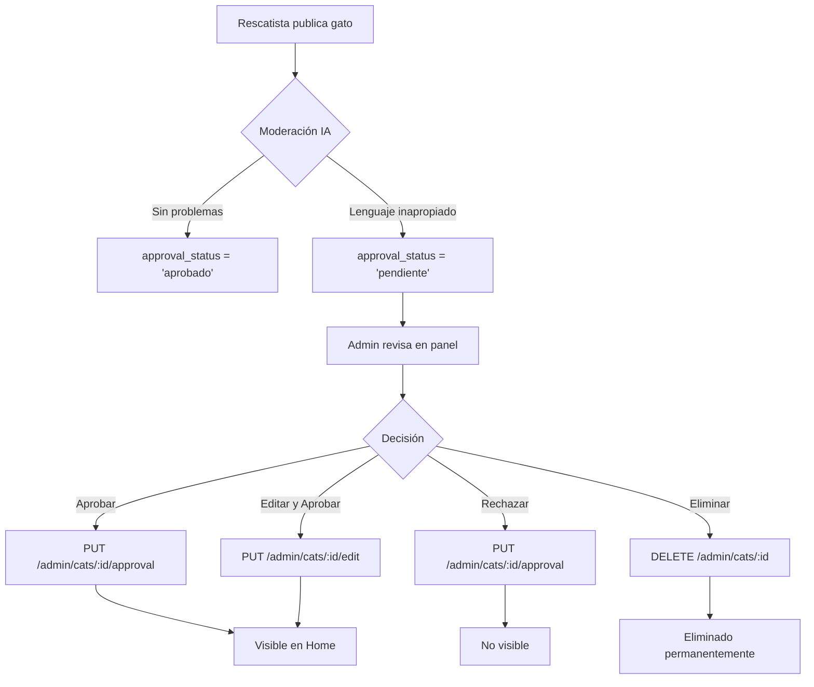

# Panel de Administración - Backend API

## 🎯 Descripción

Sistema completo de administración para gestionar publicaciones de gatos, implementado siguiendo principios SOLID.

---

## 📋 Endpoints de Administración

Todas las rutas requieren:
- ✅ **Autenticación**: Token JWT válido
- ✅ **Autorización**: Rol de `admin`

**Base URL**: `/api/admin`

---

## 🐱 Gestión de Publicaciones de Gatos

### 1. Obtener TODAS las publicaciones

```http
GET /api/admin/cats
```

**Headers:**
```
Authorization: Bearer {token}
```

**Respuesta exitosa (200):**
```json
{
  "success": true,
  "message": "Publicaciones obtenidas con éxito",
  "data": {
    "cats": [
      {
        "id": 1,
        "name": "Michi",
        "description": "...",
        "age": "2 años",
        "health_status": "Saludable",
        "sterilization_status": "esterilizado",
        "approval_status": "pendiente",
        "adoption_status": "en_adopcion",
        "owner_id": 5,
        "owner_name": "Juan Pérez",
        "owner_email": "juan@example.com",
        "created_at": "2025-11-12T00:00:00.000Z"
      }
    ],
    "summary": {
      "total": 10,
      "pendientes": 3,
      "aprobados": 6,
      "rechazados": 1
    }
  }
}
```

**Características:**
- ✅ Muestra publicaciones pendientes, aprobadas y rechazadas
- ✅ Ordenadas por estado (pendientes primero) y fecha
- ✅ Incluye información del propietario
- ✅ Resumen estadístico

---

### 2. Obtener un gato específico (sin restricción)

```http
GET /api/admin/cats/:id
```

**Headers:**
```
Authorization: Bearer {token}
```

**Parámetros:**
- `id` (path): ID del gato

**Respuesta exitosa (200):**
```json
{
  "success": true,
  "message": "Operación exitosa",
  "data": {
    "cat": {
      "id": 1,
      "name": "Michi",
      "description": "...",
      "approval_status": "pendiente"
    }
  }
}
```

---

### 3. Aprobar o Rechazar una publicación

```http
PUT /api/admin/cats/:id/approval
```

**Headers:**
```
Authorization: Bearer {token}
Content-Type: application/json
```

**Body:**
```json
{
  "status": "aprobado"  // o "rechazado"
}
```

**Respuesta exitosa (200):**
```json
{
  "success": true,
  "message": "Publicación aprobada con éxito",
  "data": {
    "cat": {
      "id": 1,
      "name": "Michi",
      "approval_status": "aprobado",
      "updated_at": "2025-11-12T01:00:00.000Z"
    }
  }
}
```

**Errores posibles:**
- `400`: Estado no válido (debe ser "aprobado" o "rechazado")
- `403`: Usuario no es administrador
- `404`: Gato no encontrado

---

### 4. Editar detalles de una publicación

```http
PUT /api/admin/cats/:id/edit
```

**Headers:**
```
Authorization: Bearer {token}
Content-Type: application/json
```

**Body:**
```json
{
  "name": "Michi Actualizado",
  "description": "Nueva descripción limpia",
  "age": "3 años",
  "health_status": "Vacunado y desparasitado",
  "sterilization_status": "esterilizado"
}
```

**Respuesta exitosa (200):**
```json
{
  "success": true,
  "message": "Gato actualizado con éxito",
  "data": {
    "cat": {
      "id": 1,
      "name": "Michi Actualizado",
      "description": "Nueva descripción limpia",
      "updated_at": "2025-11-12T01:30:00.000Z"
    }
  }
}
```

**Casos de uso:**
- ✅ Corregir lenguaje inapropiado
- ✅ Mejorar descripciones
- ✅ Actualizar información errónea

---

### 5. Eliminar una publicación

```http
DELETE /api/admin/cats/:id
```

**Headers:**
```
Authorization: Bearer {token}
```

**Respuesta exitosa (200):**
```json
{
  "success": true,
  "message": "Gato eliminado con éxito",
  "data": {
    "cat": {
      "id": 1,
      "name": "Michi",
      "deleted": true
    }
  }
}
```

**⚠️ Advertencia:** Esta acción es permanente.

---

## 🔒 Seguridad

### Middlewares Aplicados

1. **`authMiddleware`**: Verifica token JWT válido
2. **`adminMiddleware`**: Valida que `user.role === 'admin'`

### Respuestas de Error

**401 Unauthorized:**
```json
{
  "success": false,
  "message": "No autorizado"
}
```

**403 Forbidden:**
```json
{
  "success": false,
  "message": "Solo administradores pueden acceder"
}
```

**404 Not Found:**
```json
{
  "success": false,
  "message": "Gato no encontrado"
}
```

**500 Server Error:**
```json
{
  "success": false,
  "message": "Error en el servidor"
}
```

---

## 📊 Flujo de Moderación



---

## 🧪 Ejemplos de Uso

### Ejemplo 1: Aprobar publicación pendiente

```bash
curl -X PUT http://localhost:5000/api/admin/cats/3/approval \
  -H "Authorization: Bearer eyJhbGc..." \
  -H "Content-Type: application/json" \
  -d '{"status": "aprobado"}'
```

### Ejemplo 2: Editar contenido inapropiado

```bash
curl -X PUT http://localhost:5000/api/admin/cats/3/edit \
  -H "Authorization: Bearer eyJhbGc..." \
  -H "Content-Type: application/json" \
  -d '{
    "name": "Michi",
    "description": "Gato adorable y juguetón"
  }'
```

### Ejemplo 3: Ver todas las publicaciones pendientes

```bash
curl -X GET http://localhost:5000/api/admin/cats \
  -H "Authorization: Bearer eyJhbGc..."
```

---

## 🏗️ Arquitectura

### Capa de Servicio (`catService.js`)

```javascript
// Nuevas funciones agregadas:
- getAllCatsForAdmin()          // Obtiene todo sin filtrar
- updateApprovalStatus()        // Cambia estado de aprobación
- getCatByIdForAdmin()          // Obtiene sin restricción
- updateCatDetails()            // Actualiza datos del gato
- deleteCat()                   // Elimina permanentemente
```

### Capa de Controlador (`catController.js`)

```javascript
// Nuevas funciones agregadas:
- getAllCatsAdmin()             // Handler HTTP + validación admin
- updateCatApproval()           // Handler HTTP + validación estado
- getCatByIdAdmin()             // Handler HTTP sin restricción
- editCat()                     // Handler HTTP + validación datos
- deleteCat()                   // Handler HTTP con confirmación
```

### Capa de Rutas (`adminRoutes.js`)

```javascript
// Todas protegidas con authMiddleware + adminMiddleware
router.get('/cats')                    // Lista completa
router.get('/cats/:id')                // Detalle sin filtro
router.put('/cats/:id/approval')       // Aprobar/Rechazar
router.put('/cats/:id/edit')           // Editar
router.delete('/cats/:id')             // Eliminar
```

---

## ✅ Testing

### Pruebas Recomendadas

1. **Autenticación y Autorización**
   - ❌ Usuario sin token → 401
   - ❌ Usuario no-admin → 403
   - ✅ Admin con token válido → 200

2. **Aprobar/Rechazar**
   - ✅ Estado "aprobado" → 200
   - ✅ Estado "rechazado" → 200
   - ❌ Estado inválido → 400

3. **Editar**
   - ✅ Datos válidos → 200
   - ❌ Nombre vacío → 400
   - ❌ ID inexistente → 404

4. **Eliminar**
   - ✅ ID válido → 200
   - ❌ ID inexistente → 404

---

## 📝 Próximos Pasos

Para completar el sistema de administración:

1. **Frontend**: Crear `AdminDashboard.tsx`
2. **Frontend**: Crear `AdminCatReview.tsx` (componente de revisión)
3. **Frontend**: Agregar ruta `/admin` protegida
4. **Testing**: Implementar tests unitarios
5. **Logging**: Agregar logs de auditoría

---

**✨ Backend del panel de administración completamente implementado siguiendo SOLID**
